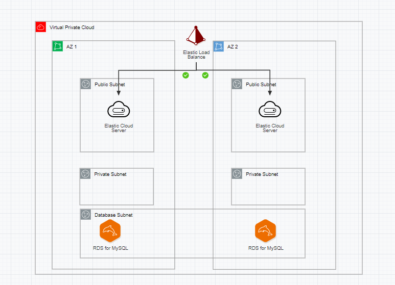
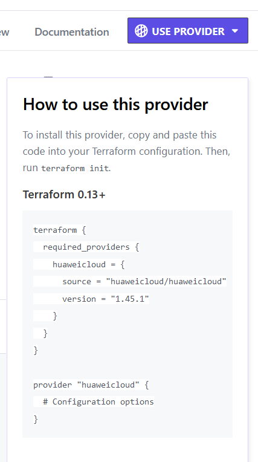
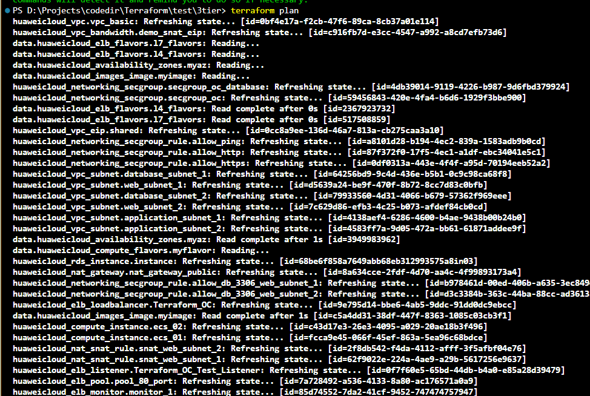
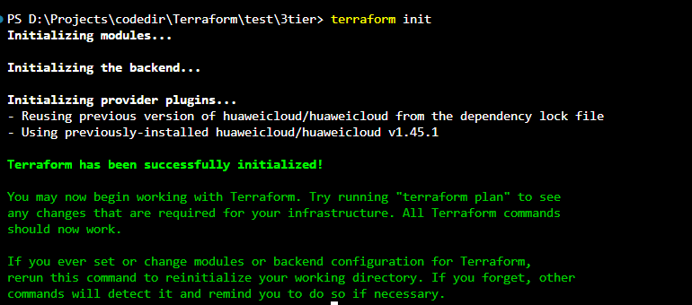
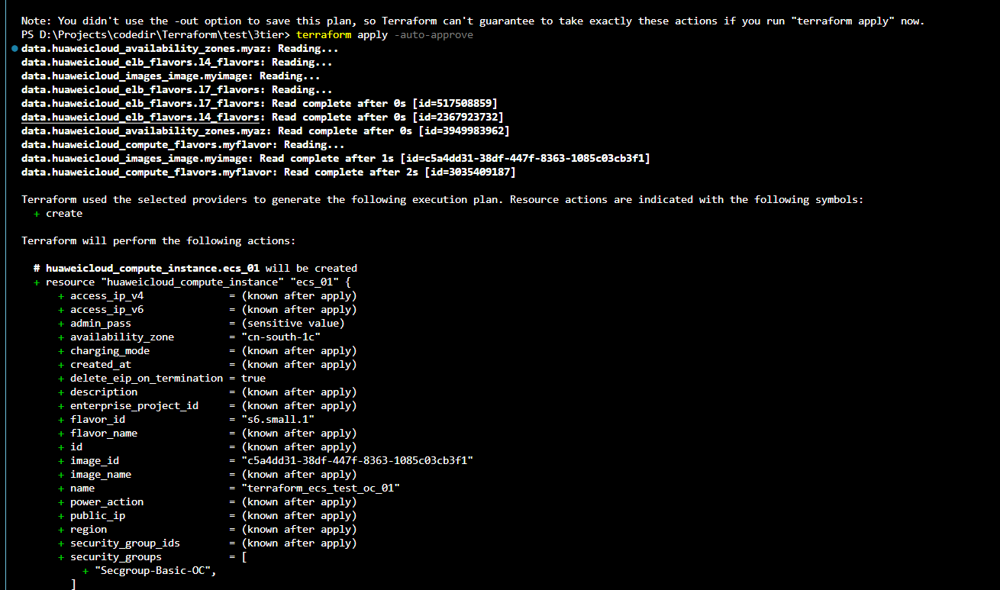
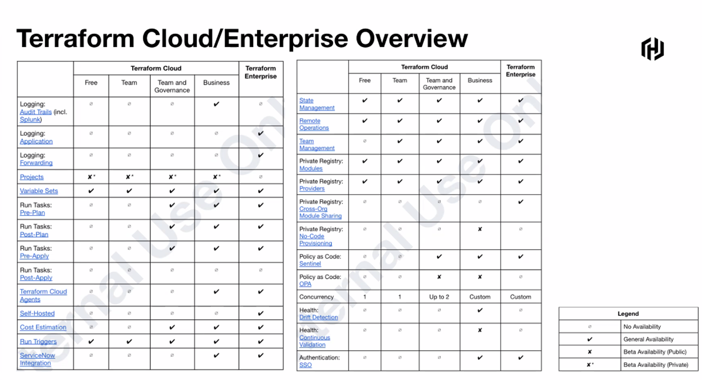
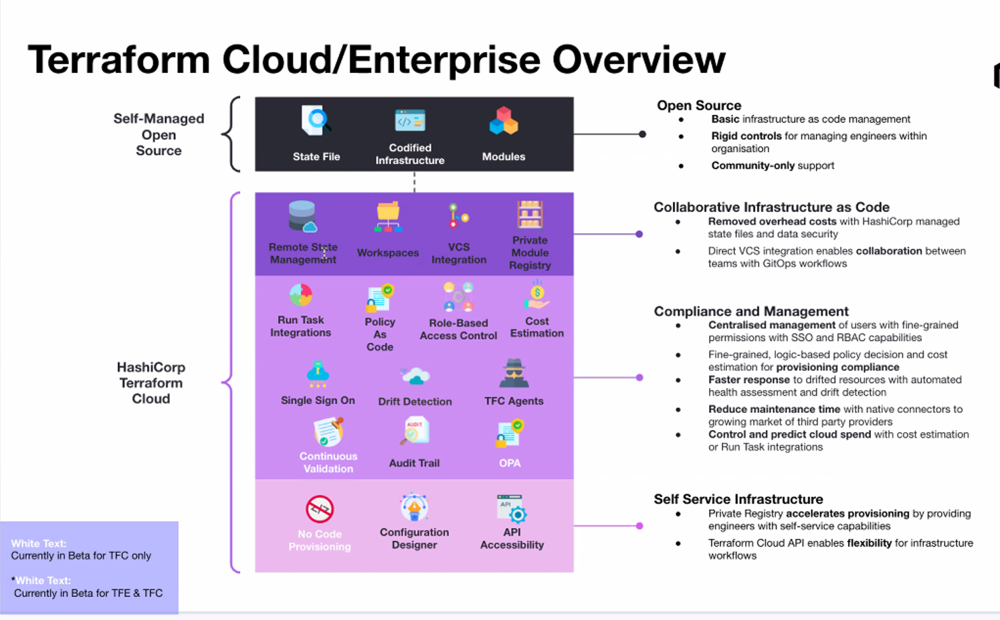

# Deploy 3tier architecuture in HuaWeiCloud\n"## **1.0 Introduction**

[Terraform](https://www.terraform.io/intro) by [HashiCorp](https://www.hashicorp.com/), is an “infrastructure as code” that allows you to build, change, and version infrastructure safely and efficiently. This includes both low-level components like computing instances, storage, and networking, as well as high-level components like DNS entries and SaaS features.

Terraform has a great set of features that make it worth adding to your tool belt, including:

* Friendly custom syntax, but also has support for JSON.
* Visibility into changes before they happen.
* Built-in graphing feature to visualize the infrastructure.
* Understands resource relationships. One example is failures are isolated to dependent resources while non-dependent resources still get created, updated, or destroyed.
* [Open Source Project](https://github.com/hashicorp/terraform) with a community of thousands of contributors who add features and updates.
* The ability to break down the configuration into smaller chunks for better organization, re-use, and maintainability. The last part of this article goes into this feature in detail.

## **2.0 Solution **Overview****



## **3.0 Prerequisites**

* Install [Terraform](https://learn.hashicorp.com/tutorials/terraform/install-cli)
* Sign up for an [HuaWei Cloud Account](https://www.huaweicloud.com/intl/en-us/)
* Your preferred [IDE](https://www.codecademy.com/articles/what-is-an-ide) (I used Visual Studio Code)
* [Terraform Cloud](https://app.terraform.io)

## **3.1 Notes Before Getting Started**

l'll be going through sections of my **main.tf** Terraform file. This Terraform file does not follow best practice of DRY (Don't Repeat Yourself) code. The best practice would be to use variables and modules rather than using a single file and hard coding.A typical three-tier architecture uses a **web, application and database layer.** In this project, although I've created an application layer, I'm not deploying any instances in the application layer and have not created a Security Group for the application layer. If you decide to do so, you will need to modify some Security Group rules and create an application layer security group.
**RDS** has **Multi-AZ** set to true for high availability. If you’d like to save money be sure to set this to false.

## **3.2  Prepare Cloud AK/SK**

1. **Download and install Terraform. Step by step is shown below.**
2. **Set up Terraform path in Environment Variable.**
3. **Create a Huawei Cloud account and set up a payment method on your Huawei Cloud account. You can create your account here.**
4. **Obtain the** **Access key & Security Key after creating your account at My credentials > Access keys > Create Access key. **If you are logon with an IAM account, you need to request AK/SK from the IAM administrator.
5. 

## 4.0 **Getting start**

### 4.1 Download and Install Terraform

1. **Download the proper package for your operating system and architecture from Terraform's Official Website.**
2. **Install Terraform by unzipping it and moving it to a directory included in your system's** [PATH](https://superuser.com/questions/284342/what-are-path-and-other-environment-variables-and-how-can-i-set-or-use-them)
3. **Verify that the installation worked by opening a new terminal session and running**  **terraform -version** **.**

**Note:** If you get an error that  **terraform could not be found** **, your path environment variable was not set up properly. Please go back and ensure that your** **PATH**.
**Variable contains the directory where Terraform was installed.**

### 4.2 Build Infrastructure

#### Configure Provider

[**Providers**](https://www.terraform.io/docs/providers/index.html) are plugins that Terraform requires so that it can install and use for your Terraform configuration. Terraform offers the ability to use a variety of  **Providers** , so it doesn’t make sense to use all of them for each file. We will declare our **Provider** as AWS.

1. Create a **main.tf** file and add each of the following sections to the **main.tf **file.
2. From the terminal in the Terraform directory containing install_apache.sh and main.tf run `terraform init`
3. Use the below code to set our **Provider** to HWC and set our Region to `cn-south-1`.
4. Latest HWC provider https://registry.terraform.io/providers/huaweicloud/huaweicloud/latest/docs



```
terraform {
  required_providers {
    huaweicloud = {
      source = "huaweicloud/huaweicloud"
      version = ">= 1.37.0"
    }
  }
} 

provider "huaweicloud" {
  region     = "cn-south-1"
  access_key = ""
  secret_key = ""

}
```

#### Create VPC and Subnets

1. Our first Resource is creating our basic VPC with CIDR 10.0.0.0/16.
2. **web_subnet_1 `10.0.1.0/24`** and **web_subnet-2 `10.0.2.0/24`** resources create our web layer .
3. **application_subnet_1 `10.0.11.0/24`** and **application_subnet_2 `10.0.12.0/24`** resources create our application layer in two availability zones. This will be a private subnet.
4. **database_subnet_1 `10.0.21.0/24`**  resources create our database layer in two availability zones. This will be a private subnet.

```
# Create Web Public Subnet
resource "huaweicloud_vpc_subnet" "web_subnet_1" {
  vpc_id = huaweicloud_vpc.vpc_basic.id
  name = "OC_TERRAFORM_WEB_SUBNET_1"
  cidr = "10.0.1.0/24"
  gateway_ip = "10.0.1.1"

}


resource "huaweicloud_vpc_subnet" "web_subnet_2" {
  vpc_id = huaweicloud_vpc.vpc_basic.id
  name = "OC_TERRAFORM_WEB_SUBNET_2"
  cidr = "10.0.2.0/24"
  gateway_ip = "10.0.2.1"

}


# Create Application Public Subnet
resource "huaweicloud_vpc_subnet" "application_subnet_1" {
  vpc_id = huaweicloud_vpc.vpc_basic.id
  name = "OC_TERRAFORM_APPLICATION_SUBNET_1"
  cidr = "10.0.11.0/24"
  gateway_ip = "10.0.11.1"
}


resource "huaweicloud_vpc_subnet" "application_subnet_2" {
  vpc_id = huaweicloud_vpc.vpc_basic.id
  name = "OC_TERRAFORM_APPLICATION_SUBNET_2"
  cidr = "10.0.12.0/24"
  gateway_ip = "10.0.12.1"
}

# Create Database Private Subnet
resource "huaweicloud_vpc_subnet" "database_subnet_1" {
  vpc_id = huaweicloud_vpc.vpc_basic.id
  name = "OC_TERRAFORM_DATABASE_SUBNET_1"
  cidr = "10.0.21.0/24"
  gateway_ip = "10.0.21.1"
}
```

#### Create NAT GATEWAY (SNAT) for public subnetCreate NAT

WEB layer which could access pubic internet reside in public subnet.

1. Create nat getway instance associate with an EIP
2. Configure two SNAT rules linked to two web subnets

```
# 1: Small type, which supports up to 10,000 SNAT connections.
# 2: Medium type, which supports up to 50,000 SNAT connections.
# 3: Large type, which supports up to 200,000 SNAT connections.
# 4: Extra-large type, which supports up to 1,000,000 SNAT connections.
resource "huaweicloud_nat_gateway" "nat_gateway_public" {
  name        = "OC_DEMO_NAT_GATEWAY"
  description = "test for OC terraform"
  spec        = "3"
  vpc_id      = huaweicloud_vpc.vpc_basic.id
  subnet_id   = huaweicloud_vpc_subnet.web_subnet_1.id
}


####  Create EIP for NAT GATEWAY
resource "huaweicloud_vpc_bandwidth" "demo_snat_eip" {
  name = "demo_snat_eip"
  size = 5
}

resource "huaweicloud_vpc_eip" "shared" {
  publicip {
    type = "5_bgp"
  }

  bandwidth {
    share_type = "WHOLE"
    id         = huaweicloud_vpc_bandwidth.demo_snat_eip.id
  }
}

# snat rule web_subnet_1
resource "huaweicloud_nat_snat_rule" "snat_web_subnet_1" {
  nat_gateway_id = huaweicloud_nat_gateway.nat_gateway_public.id
  depends_on = [
    huaweicloud_vpc_bandwidth.demo_snat_eip
  ]
  floating_ip_id = huaweicloud_vpc_eip.shared.id
  subnet_id      = huaweicloud_vpc_subnet.web_subnet_1.id
}
# snat rule web_subnet_2
resource "huaweicloud_nat_snat_rule" "snat_web_subnet_2" {
  nat_gateway_id = huaweicloud_nat_gateway.nat_gateway_public.id
  depends_on = [
    huaweicloud_vpc_bandwidth.demo_snat_eip
  ]
  floating_ip_id = huaweicloud_vpc_eip.shared.id
  subnet_id      = huaweicloud_vpc_subnet.web_subnet_2.id
}
```

#### Create  Security Group

1. Basic Security group is set to our web servers(open 80 and 443 for all).
2. Database security group allow traffic from web subnets

```
# create basic security group
resource "huaweicloud_networking_secgroup" "secgroup_oc" {
  name        = "Secgroup-Basic-OC"
  description = "basic security group"
}

# allow ping
resource "huaweicloud_networking_secgroup_rule" "allow_ping" {
  direction         = "ingress"
  ethertype         = "IPv4"
  protocol          = "icmp"
  remote_ip_prefix  = "0.0.0.0/0"
  security_group_id = huaweicloud_networking_secgroup.secgroup_oc.id
}

# allow https
resource "huaweicloud_networking_secgroup_rule" "allow_https" {
  direction         = "ingress"
  ethertype         = "IPv4"
  protocol          = "tcp"
  port_range_min    = 443
  port_range_max    = 443
  remote_ip_prefix  = "0.0.0.0/0"
  security_group_id = huaweicloud_networking_secgroup.secgroup_oc.id
}

# allow http
resource "huaweicloud_networking_secgroup_rule" "allow_http" {
  direction         = "ingress"
  ethertype         = "IPv4"
  protocol          = "tcp"
  port_range_min    = 80
  port_range_max    = 80
  remote_ip_prefix  = "0.0.0.0/0"
  security_group_id = huaweicloud_networking_secgroup.secgroup_oc.id
}


# create database security group
resource "huaweicloud_networking_secgroup" "secgroup_oc_database" {
  name        = "Secgroup-database-OC"
  description = "basic security group"
}

resource "huaweicloud_networking_secgroup_rule" "allow_db_3306_web_subnet_1" {
  direction         = "ingress"
  ethertype         = "IPv4"
  protocol          = "tcp"
  port_range_min    = 3306
  port_range_max    = 3306
  remote_ip_prefix  = huaweicloud_vpc_subnet.web_subnet_1.cidr
  security_group_id = huaweicloud_networking_secgroup.secgroup_oc_database.id
}
resource "huaweicloud_networking_secgroup_rule" "allow_db_3306_web_subnet_2" {
  direction         = "ingress"
  ethertype         = "IPv4"
  protocol          = "tcp"
  port_range_min    = 3306
  port_range_max    = 3306
  remote_ip_prefix  = huaweicloud_vpc_subnet.web_subnet_2.cidr
  security_group_id = huaweicloud_networking_secgroup.secgroup_oc_database.id
}
```

#### Create two CES reside in two AZs

```
# Create two ECS reside in web subnet
data "huaweicloud_compute_flavors" "myflavor" {
  availability_zone = data.huaweicloud_availability_zones.myaz.names[2]
  performance_type  = "normal"
#   generation = "s6"
  cpu_core_count    = 1
  memory_size       = 1
}


data "huaweicloud_images_image" "myimage" {
  name        = "Ubuntu 18.04 server 64bit"
  most_recent = true
}


resource "huaweicloud_compute_instance" "ecs_01" {
  name              = "terraform_ecs_test_oc_01"
  admin_pass        = "xxx"
  image_id          = data.huaweicloud_images_image.myimage.id
  flavor_id = "s6.small.1"
  depends_on = [
    huaweicloud_networking_secgroup.secgroup_oc
  ]
  security_groups   = [huaweicloud_networking_secgroup.secgroup_oc.name]
  availability_zone   = "cn-south-1c"
  network {
    uuid = huaweicloud_vpc_subnet.web_subnet_1.id
  }
}

resource "huaweicloud_compute_instance" "ecs_02" {
  name              = "terraform_ecs_test_oc_02"
  admin_pass        = "xxx"
  image_id          = data.huaweicloud_images_image.myimage.id
  flavor_id = "s6.small.1"
  depends_on = [
    huaweicloud_networking_secgroup.secgroup_oc
  ]
  security_groups   = [huaweicloud_networking_secgroup.secgroup_oc.name]
  availability_zone   = "cn-south-1e"
  network {
    uuid = huaweicloud_vpc_subnet.web_subnet_2.id
  }
}
```

#### Create ELB points to 2 ECS

```
data "huaweicloud_elb_flavors" "l7_flavors" {
  type            = "L7"
  max_connections = 200000
  cps             = 2000
  bandwidth       = 50
}
data "huaweicloud_elb_flavors" "l4_flavors" {
  type            = "L4"
  max_connections = 500000
  cps             = 10000
  bandwidth       = 50
}

resource "huaweicloud_elb_loadbalancer" "Terraform_OC" {
  name              = "Terraform_OC_ELB"
  description       = "Terraform_OC"
  cross_vpc_backend = true

  vpc_id            = huaweicloud_vpc.vpc_basic.id
  # ipv6_network_id   = "{{ ipv6_network_id }}"
  # ipv6_bandwidth_id = "{{ ipv6_bandwidth_id }}"
  ipv4_subnet_id    = huaweicloud_vpc_subnet.web_subnet_2.subnet_id

  l4_flavor_id = data.huaweicloud_elb_flavors.l4_flavors.ids[0]
  l7_flavor_id = data.huaweicloud_elb_flavors.l7_flavors.ids[0]

  availability_zone = [
   "cn-south-1c",
   "cn-south-1e",
   "cn-south-1f"
 
  ]


  iptype                = "5_bgp"
  bandwidth_charge_mode = "traffic"
  sharetype             = "PER"
  bandwidth_size        = 10
}


resource "huaweicloud_elb_listener" "Terraform_OC_Test_Listener" {
  name            = "basic"
  description     = "basic description"
  protocol        = "HTTP"
  protocol_port   = 80
  loadbalancer_id = huaweicloud_elb_loadbalancer.Terraform_OC.id

  idle_timeout     = 60
  request_timeout  = 60
  response_timeout = 60

}

resource "huaweicloud_elb_pool" "pool_80_port" {
  name = "pool_80_port"
  protocol    = "HTTP"
  lb_method   = "ROUND_ROBIN"
  depends_on = [
    huaweicloud_elb_listener.Terraform_OC_Test_Listener
  ]
  listener_id = huaweicloud_elb_listener.Terraform_OC_Test_Listener.id

  
}

resource "huaweicloud_elb_monitor" "monitor_1" {
  protocol    = "HTTP"
  interval    = 30
  timeout     = 15
  max_retries = 10
  url_path    = "/"
  port        = 80
  pool_id     = huaweicloud_elb_pool.pool_80_port.id
}

resource "huaweicloud_elb_member" "member_1" {
  address       = huaweicloud_compute_instance.ecs_01.network[0].fixed_ip_v4
  protocol_port = 80
  pool_id       = huaweicloud_elb_pool.pool_80_port.id
  subnet_id     = huaweicloud_vpc_subnet.web_subnet_1.ipv4_subnet_id
}
resource "huaweicloud_elb_member" "member_2" {
  address       = huaweicloud_compute_instance.ecs_02.network[0].fixed_ip_v4
  protocol_port = 80
  pool_id       = huaweicloud_elb_pool.pool_80_port.id
  subnet_id     = huaweicloud_vpc_subnet.web_subnet_2.ipv4_subnet_id
}
```

#### Create RDS master/slave mode reside in two az

```
resource "huaweicloud_rds_instance" "instance" {
  name                = "terraform_test_rds_instance"
  flavor              = "rds.pg.n1.large.2.ha"
  ha_replication_mode = "async"
  vpc_id              = huaweicloud_vpc.vpc_basic.id
  subnet_id           = huaweicloud_vpc_subnet.database_subnet_1.id
  security_group_id   = huaweicloud_networking_secgroup.secgroup_oc_database.id
  availability_zone   = [
    "cn-south-1c",
    "cn-south-1e"]

  db {
    type     = "PostgreSQL"
    version  = "12"
    password = "Huangwei!120521"
  }
  volume {
    type = "CLOUDSSD"
    size = 100
  }
  backup_strategy {
    start_time = "08:00-09:00"
    keep_days  = 1
  }
}
```

#### Implement main.tf

Terraform CLI

https://developer.hashicorp.com/terraform/cli

1. `terraform init` command initializes a working directory containing Terraform configuration files. This is the first command that should be run after writing a new Terraform configuration or cloning an existing one from version control. It is safe to run this command multiple times.



2. `terraform plan` command creates an execution plan, which lets you preview the changes that Terraform plans to make to your infrastructure. By default, when Terraform creates a plan it:

* Reads the current state of any already-existing remote objects to make sure that the Terraform state is up-to-date.
* Compares the current configuration to the prior state and noting any differences.
* Proposes a set of change actions that should, if applied, make the remote objects match the configuration.
  

3. `terraform apply -auto-approve` command executes the actions proposed in a Terraform plan.



### 4.3 Implementation in Terraform Cloud

Create an account in [Terraform Cloud](https://app.terraform.io/public/signup/account?product_intent=terraform)






"
